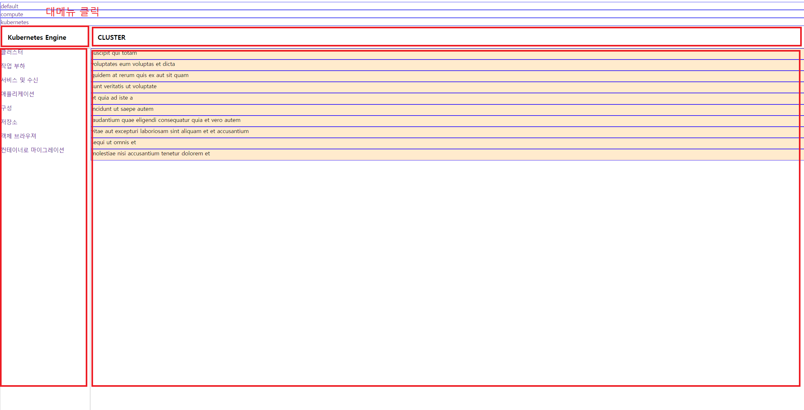
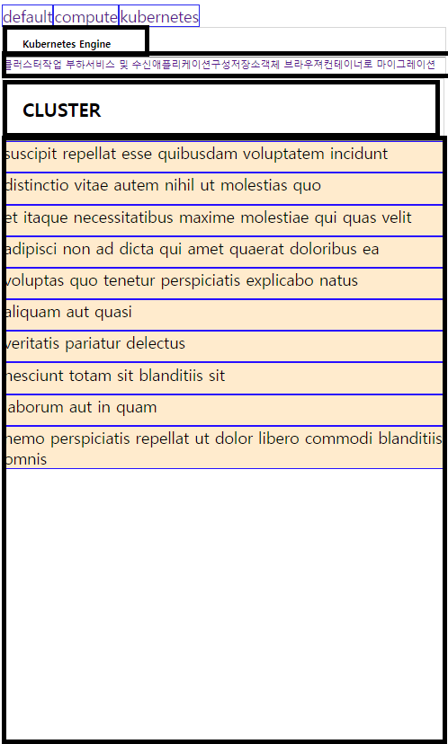

****
# 설치 install npm modules
```$xslt
npm install
```

# 작동 start dev-server
```$xslt
npm run start
```

# 빌드 webpack build production mode
```$xslt
npm run build
```

# 테스트 jest test
```$xslt
npm run test
```


# src/ 디렉토리구조
```
src
│   index.tsx
│   styles.css
│   styles.scss
│
├───components /*공통으로 사용되는 coponent들 입니다*/
│       App.tsx
│       CfcActionBar.scss
│       CfcActionBar.tsx
│       CfcContainer.scss
│       CfcContainer.tsx
│       CfcContentList.scss
│       CfcContentList.tsx
│       CfcNavigationArea.scss
│       CfcNavigationArea.tsx
│       CfcPanel.scss
│       CfcPanel.tsx
│       CfcPanelBody.scss
│       CfcPanelBody.tsx
│       CfcSectionTitle.scss
│       CfcSectionTitle.tsx
│
├───hooks
│       useCfcNavigationArea.ts
│       useCfcPanelBody.ts
│
├───model
│       ComputeModel.ts
│       KubernetesModel.ts
│       PanelBodyModel.ts
│
├───pages /*page를 모아놓는 디렉토리입니다*/
│       ComputePage.tsx
│       KubernetesPage.tsx
│
├───repository
│       api.ts
│
└───store
        DomainStore.ts
```

# 768px 초과


# 768px 이하

